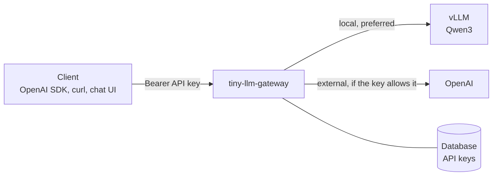

# tiny-llm-gateway

A small, OpenAI-compatible LLM gateway for organisations that run open-weight models on their own hardware and want *controlled* access to cloud models on top.

- **One API for all models.** Clients use the standard OpenAI API (including streaming) and pick a model by alias. The gateway routes each request to a self-hosted backend (e.g. vLLM) or an external provider (e.g. OpenAI).
- **Automatic fallback.** Each model alias has an ordered list of deployments. If one fails, the gateway tries the next.
- **External access is opt-in per API key.** Prompts sent to a cloud provider leave the organisation, so only keys with `allow_external` may reach external backends, directly or as a fallback.

> Status: work in progress. The gateway and its Helm chart work; usage accounting and metrics are being added.

## How it works



A request for a model alias goes through three steps:

1. **Policy.** The gateway resolves the alias to its deployments. For a key without `allow_external`, external deployments are removed. If none are left, the request fails with `403 external_models_not_allowed`.
2. **Ordering.** Deployments that failed recently are in *cooldown* and move to the end of the list, so healthy ones are tried first. They aren't dropped, so there's always a last resort.
3. **Fallback.** Deployments are tried in order. The gateway moves on to the next one on connection errors, timeouts, HTTP 429 and 5xx. Other 4xx errors are returned to the client as-is, since a malformed request would fail everywhere. If every deployment fails, the client gets `503 no_backend_available`.

Every response carries two headers:

| Header | Meaning |
|---|---|
| `Gateway-Backend` | The backend that served the request, e.g. `local` or `openai` |
| `Gateway-Attempts` | How many deployments were tried; `2` means one fallback happened |

The response body stays exactly what the backend returned, so strict OpenAI clients keep working. The `model` field in the body shows the upstream model that actually answered.

### Streaming and fallback

For `stream: true`, the gateway waits for the backend's **first chunk** before it commits to that backend. A backend that refuses the connection, returns an error status, or dies before sending anything is skipped like in the non-streaming case.

Once the first bytes have reached the client, the response belongs to that backend. If it breaks mid-stream, the gateway ends the stream with an OpenAI-style error event (`stream_interrupted`) followed by `data: [DONE]`. Switching backends silently at that point would hand the client two half-answers glued together.

Ways to lift this limitation, each with a cost:

| Approach | Trade-off |
|---|---|
| Hold back the first N tokens before forwarding | Catches early failures, but delays the first visible token |
| Buffer the whole response | No mid-stream failures at all, but defeats the point of streaming |
| Resume on the next backend: send the partial answer as an assistant prefix and let it continue | vLLM supports this (`continue_final_message`), OpenAI's Chat API does not; the style can shift between models |
| Let the client retry | Pushes the complexity onto every client |

In practice, the most common cause of broken streams in Kubernetes is pods being stopped during rollouts or scale-down. Graceful termination, so running streams can finish, avoids most of them.

## Configuration

### Routes

Backends and model aliases are defined in a YAML file. [`gateway/routes.dev.yaml`](gateway/routes.dev.yaml) is a complete example:

```yaml
backends:
  local:
    base_url: http://127.0.0.1:9000/v1     # any OpenAI-compatible server
  openai:
    base_url: https://api.openai.com/v1
    api_key_env: OPENAI_API_KEY            # name of the env var holding the key
    external: true                         # only keys with allow_external may use it

models:
  qwen3:                                   # alias that clients request
    - backend: local                       # tried first
      model: Qwen/Qwen3-0.6B               # model name sent to the backend
    - backend: openai                      # fallback
      model: gpt-4.1-mini
  gpt-4.1-mini:                            # external model, requestable directly
    - backend: openai
      model: gpt-4.1-mini
```

Notes:
- If the variable named in `api_key_env` isn't set, that backend is disabled at startup with a warning. Model aliases left without deployments are disabled too, so a setup without cloud credentials still serves its local models.
- A deployment can set `default_params`, which are merged *under* the client's request body. Use this for backend-specific parameters that other providers would reject. For example, this turns off Qwen3's thinking mode on vLLM without breaking the fallback to OpenAI:

  ```yaml
  - backend: local
    model: Qwen/Qwen3-0.6B
    default_params:
      chat_template_kwargs: {enable_thinking: false}
  ```

### Environment variables

| Variable | Default | Meaning |
|---|---|---|
| `GATEWAY_MASTER_KEY` | (required) | Secret for the `/admin` endpoints |
| `GATEWAY_DATABASE_URL` | `sqlite+aiosqlite:///./gateway.db` | SQLAlchemy URL, e.g. `postgresql+asyncpg://user:pw@host/db` |
| `GATEWAY_ROUTES_FILE` | `routes.yaml` | Path to the routes YAML |
| `GATEWAY_CONNECT_TIMEOUT` | `3.0` | Seconds to connect to a backend. Keep it short so fallback is fast. |
| `GATEWAY_READ_TIMEOUT` | `300.0` | Seconds to wait for data from a backend |
| `GATEWAY_COOLDOWN_SECONDS` | `30.0` | How long a failed deployment moves to the end of the list |

## API

| Endpoint | Auth | Description |
|---|---|---|
| `POST /v1/chat/completions` | API key | OpenAI Chat Completions, with and without `stream` |
| `GET /v1/models` | API key | The model aliases this key may use |
| `POST /admin/keys` | Master key | Create a key: `{"alias": "team-a", "allow_external": true}`. The secret is returned only once. |
| `GET /admin/keys` | Master key | List keys (without secrets) |
| `PATCH /admin/keys/{id}` | Master key | Change `allow_external` or `active` |
| `GET /healthz` | none | Liveness |
| `GET /readyz` | none | Readiness (database reachable) |

API keys are stored as SHA-256 hashes. Errors use OpenAI's format, `{"error": {"message", "type", "code"}}`, so SDKs surface them properly.

## Running on Kubernetes

The Helm chart in [`chart/`](chart/) deploys the gateway (2 replicas), vLLM serving Qwen3-0.6B on CPU, and PostgreSQL for the API keys. These instructions use [minikube](https://minikube.sigs.k8s.io/) and a bash shell; on Windows, use WSL 2. They work on x86-64 (AVX2 or AVX-512) as well as ARM64.

You need minikube, [Helm](https://helm.sh/) and kubectl. With the Docker driver, give Docker at least 14 GB of memory (Docker Desktop: *Settings → Resources*; with WSL 2, set `memory=` in `.wslconfig`).

**1. Start a cluster and build the gateway image into it:**

```bash
minikube start --cpus=6 --memory=12g
minikube image build -t tiny-llm-gateway:0.1.0 gateway/
```

minikube runs its own container runtime, so images built with plain `docker build` aren't visible to it. `minikube image build` builds directly inside the cluster.

**2. Optional: store your OpenAI key** as a Kubernetes Secret. Without it, the gateway only serves local models.

```bash
kubectl create secret generic openai --from-literal=api-key=sk-...
```

**3. Install the chart:**

```bash
helm install tlg chart --set openai.existingSecret=openai   # drop --set without an OpenAI key
kubectl rollout status deploy/tlg-vllm --timeout=20m
```

On its first start, vLLM downloads the model (about 1.4 GB) into a persistent volume and compiles it for the CPU; the vLLM image itself is about 1.6 GB on x86-64. Expect several minutes before the rollout finishes. Restarts reuse the downloaded model and the compiled code.

For a quick setup without vLLM, use the lightweight variant instead. A mock backend replaces vLLM, and the whole release needs well under 1 GB of memory:

```bash
helm install tlg chart -f chart/values-mock.yaml --set openai.existingSecret=openai
```

**4. Talk to the gateway.** Forward its port and read the generated master key:

```bash
kubectl port-forward svc/tlg-gateway 8080:8080   # keep running in a separate terminal
MASTER_KEY=$(kubectl get secret tlg -o jsonpath='{.data.master-key}' | base64 -d)
```

From here on, the requests are the same as in [Local development](#local-development), step 3, using `$MASTER_KEY` instead of `dev`.

**5. Run the built-in test.** It creates a temporary key, sends one request through the gateway and deactivates the key again:

```bash
helm test tlg --logs
```

### Guided demo

[`scripts/demo.sh`](scripts/demo.sh) runs all of the above and then walks through the gateway's features step by step:

1. Starts minikube if needed, builds the image and installs the chart
2. Creates two API keys: `team-a` may use external models, `team-b` may not
3. `team-a` asks the local model, once normally and once streamed, then the external model
4. `team-b` asks for the external model and gets `403`
5. The local model server is scaled to 0: `team-a` falls back to OpenAI, `team-b` gets `503`, because its prompts must not leave the cluster

```bash
export OPENAI_API_KEY=sk-...   # optional; without it, the external steps are skipped
scripts/demo.sh                # or: scripts/demo.sh --mock  (no vLLM)
```

The script needs `minikube`, `kubectl`, `helm`, `curl` and `jq`. It pauses between steps; set `DEMO_PAUSE=0` to run it straight through, and `DEMO_PORT` if port 8080 is taken. Re-running it is safe. Abbreviated output of the `team-a` step:

```
=== 4. team-a: local model, streamed local model, external model ===
HTTP 200   Gateway-Backend: local   Gateway-Attempts: 1
  [Qwen/Qwen3-0.6B] An LLM gateway is a platform that enables users to interact with large language models ...
```

### Chart configuration

The most important values; see [`chart/values.yaml`](chart/values.yaml) for all of them:

| Value | Default | Meaning |
|---|---|---|
| `localBackend` | `vllm` | Model server behind the `local` backend: `vllm` or `mock` (fake backend, see `values-mock.yaml`) |
| `routes` | local backend, then OpenAI | Rendered into the gateway's routes file; see [Routes](#routes). Values may use templates. |
| `openai.existingSecret` | `""` | Secret holding the OpenAI key, under `openai.existingSecretKey` (`api-key`) |
| `gateway.replicas` | `2` | Gateway pods |
| `gateway.masterKey` | generated | Admin secret; generated on install and kept on upgrades |
| `vllm.model` | `Qwen/Qwen3-0.6B` | Any model from Hugging Face that fits into memory |
| `vllm.dtype` | `float32` | `bfloat16` is faster on CPUs with native BF16 support (e.g. recent Xeons), but very slow elsewhere |
| `vllm.cpuThreads` | `4` | Inference threads; keep at or below the CPU request |
| `vllm.resources` | 4 CPU, 5–8 Gi | Requests and limits of the vLLM pod |
| `postgres.enabled` | `true` | Deploy PostgreSQL. Set to `false` and set `externalDatabase.url` to use a managed database. |

Design notes on the chart:

- **Graceful shutdown.** Gateway and vLLM pods wait briefly before stopping, so the Service stops sending them new requests, and running streams can finish. The gateway allows 30 s for that, vLLM 60 s.
- **PostgreSQL** runs as a single-replica StatefulSet on the official image. That's plenty for API keys. For production, use a managed database or an operator like CloudNativePG.
- **Several gateway replicas create the schema concurrently** on first start. A Postgres advisory lock serialises that.
- **The vLLM cache volume is kept** when switching to the mock backend or uninstalling, so the model isn't downloaded again. To free the space: `kubectl delete pvc tlg-vllm-cache`.

### Troubleshooting

| Symptom | Fix |
|---|---|
| vLLM pod `Pending` | Not enough memory or CPU in the cluster. Check `kubectl describe pod -l app.kubernetes.io/component=vllm`, then restart minikube with more resources or lower `vllm.resources`. |
| vLLM pod `OOMKilled` | Raise `vllm.resources.limits.memory`, or lower `vllm.kvCacheSpaceGiB` / `vllm.maxModelLen` |
| vLLM restarts during startup | The model download takes longer than `vllm.startupTimeoutSeconds` (default 20 min); raise it |
| vLLM logs `No available shared memory broadcast block found` for many minutes | The CPU lacks fast paths for the chosen dtype (typically `bfloat16`) or is oversubscribed. Use `vllm.dtype=float32` and keep `vllm.cpuThreads` at or below the CPUs available to minikube. |
| Gateway answers `503 no_backend_available` | vLLM isn't ready yet, and the key may not use external models. Check `kubectl get pods`. |
| `helm upgrade` doesn't switch between the full and the mock variant | Helm reuses the previous values when an upgrade gets no `-f`/`--set`. Pass `--reset-values`. |
| Changed `postgres.password` has no effect | The password only applies when the volume is first initialised. Delete the PVC `data-tlg-postgres-0` to start fresh. |

## Local development

You need [uv](https://docs.astral.sh/uv/). It installs the right Python version (3.14) on its own.

```bash
cd gateway
uv sync
```

**1. Start the mock backend.** It's an OpenAI-compatible fake that echoes the prompt. It stands in for vLLM, so no GPU or model download is needed.

```bash
uv run uvicorn app.mock_upstream:app --port 9000
```

You can make it flaky with `MOCK_FAILURE_RATE=0.5`, or slower with `MOCK_TOKEN_DELAY=0.2` (seconds between streamed tokens).

**2. Start the gateway** in a second terminal. It uses a local SQLite file by default.

```bash
export GATEWAY_MASTER_KEY=dev
export GATEWAY_ROUTES_FILE=routes.dev.yaml
export OPENAI_API_KEY=sk-...      # optional; without it, only local models are served
uv run uvicorn app.main:create_app --factory --port 8080 --reload
```

**3. Create an API key and send requests** (the first command uses [jq](https://jqlang.org/)):

```bash
KEY=$(curl -s -X POST localhost:8080/admin/keys \
  -H 'Authorization: Bearer dev' -H 'Content-Type: application/json' \
  -d '{"alias": "me", "allow_external": true}' | jq -r .key)

curl -i localhost:8080/v1/chat/completions \
  -H "Authorization: Bearer $KEY" -H 'Content-Type: application/json' \
  -d '{"model": "qwen3", "messages": [{"role": "user", "content": "Hello"}]}'

curl -N localhost:8080/v1/chat/completions \
  -H "Authorization: Bearer $KEY" -H 'Content-Type: application/json' \
  -d '{"model": "qwen3", "stream": true, "messages": [{"role": "user", "content": "Hello"}]}'
```

To see the fallback, stop the mock backend and repeat the request. With `OPENAI_API_KEY` set, the answer now comes from OpenAI (`Gateway-Backend: openai`, `Gateway-Attempts: 2`). A key created with `"allow_external": false` gets `503` instead.

Any OpenAI SDK works as a client:

```python
from openai import OpenAI

client = OpenAI(base_url="http://localhost:8080/v1", api_key=KEY)
reply = client.chat.completions.create(
    model="qwen3", messages=[{"role": "user", "content": "Hello"}]
)
```

**Tests and linting:**

```bash
uv run pytest
uv run ruff check . && uv run ruff format --check .
```

The tests need no running services: backends are faked with `httpx2.MockTransport` and the database is a temporary SQLite file. They cover the access policy, fallback on each kind of failure, cooldown ordering, streaming (including fallback before the first chunk and mid-stream failures), auth and config loading.

## Project layout

```
chart/                 Helm chart (gateway, vLLM, mock backend, PostgreSQL)
  values.yaml          defaults: vLLM on CPU, then OpenAI
  values-mock.yaml     lightweight variant with the mock backend (localBackend: mock)
gateway/
  Dockerfile           one image for the gateway and the mock backend
  app/
    main.py            FastAPI app and OpenAI-compatible endpoints
    routing.py         policy filter, fallback, cooldown, streaming relay
    upstream.py        requests to OpenAI-compatible backends
    config.py          settings (env) and routes (YAML)
    auth.py, admin.py  API keys and admin endpoints
    db.py, models.py   database setup and tables
    mock_upstream.py   fake OpenAI-compatible backend for development
  tests/               pytest suite with fake upstreams
  routes.dev.yaml      routes for local development
scripts/
  demo.sh              guided end-to-end demo on minikube
```
